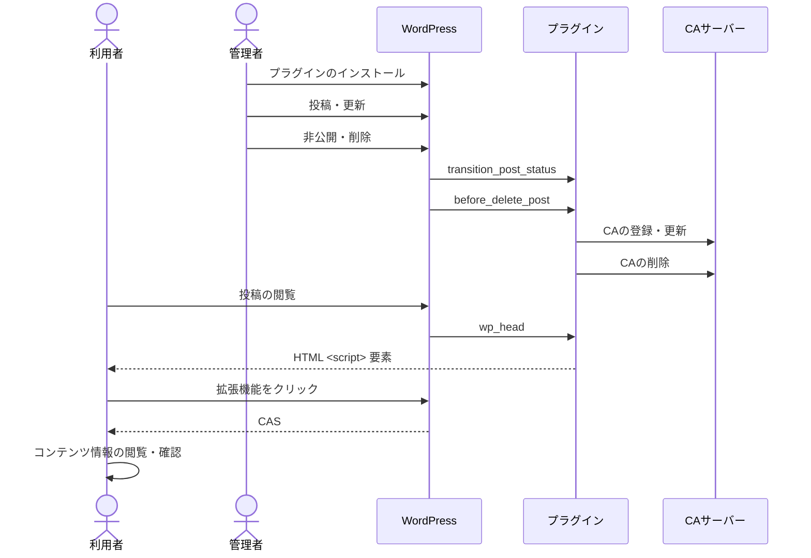

# WordPressプラグイン (CA Manager)

WordPress での記事の公開時の Content Attestation (CA) の発行に役立つプラグインです。

電通総研CAサーバを利用する場合には、電通総研CAサーバの設定マニュアルを併せてご参照下さい。

<!-- prettier-ignore-start -->
<!-- environments-start -->

<!-- NOTE: Auto-generated by ../../scripts/update-readme-environments.ts from package.json, .github/workflows/test.yml, Dockerfile, and manifest.json. Edit the source, not this section. -->

## Environment

### Verified

- OS: Ubuntu 24.04
- Base image: `wordpress:6.9.4-php8.2`

### Development

- Node.js: `^22.18.0 || ^24.10.0 || ^26.2.0`
- pnpm: `11.0.9`

<!-- environments-stop -->
<!-- prettier-ignore-end -->

### Incompatible

- Non-Apache servers (e.g. nginx): .htaccess is generated only for Apache; configure access control manually.
- Autoptimize (incl. Pro): HTML/image minification can break signature verification. See "Known issues".

### PHP のサポート方針

このプラグインは、PHP のバージョンについて[アクティブなセキュリティサポートのある環境](https://endoflife.date/php)を下限としてサポートします。
この下限を下回る PHP は、正式なサポート対象外です。

CA Manager が動作を検証しているのは、現時点では [Verified](#verified) に記載の Docker イメージのみです。

PHP 7.4 のように下限を下回る環境では、現在のコードのままでは動作しません。
動作させるには、コードの一部を書き換える必要があります (詳細は後述の[もっと古い PHP でも動かせますか?](#もっと古い-php-74-など-でも動かせますか)を参照してください)。

## 機能

このプラグインの主な機能は以下の通りです。

1. WordPressでの投稿・更新時の投稿内容の処理
   - WordPressでの投稿または更新をトリガーとします
   - このトリガーにより投稿内容を処理し、CAサーバーのCA登録・更新エンドポイントに送信します
2. WordPressの投稿ページでのCAS配信

## デモ

プラグインインストール済みの試験用環境を用意しています。

- https://op.cms.am/ (最新のメイン試験環境)

デモサイトの編集権限が必要な方は開発チームに相談してください。

## プラグインのインストール


1. プラグインのダウンロード:
   「[Releases](https://github.com/originator-profile/originator-profile/releases)」にアクセスし、AssetsセクションからWordPressプラグイン（wordpress-ca-manager.zip）を取得
2. プラグインのアップロード:
   WordPress公式サイト「[プラグイン新規追加画面](https://ja.wordpress.org/support/article/plugins-add-new-screen/)」にある「プラグインをアップロード」の節を参照
3. プラグインの有効化
4. プラグインの設定:
   WordPress 管理者画面の「設定 > CA Manager」にアクセスし、以下の必要項目を入力 (後述)
5. `/.well-known/sp.json` の配置:
   詳細は「[サイトのOP対応](https://cip.docs.originator-profile.org/studies/general-instruction/sp-setup-guide/)」を参照

## 設定

### CA発行対象の除外

「設定 > CA Manager > CA発行対象の除外」で、CA を自動発行しない URL・パターンを1行に1件入力し、「除外設定を保存」を押します。この設定は CA サーバーの設定と独立して保存できます。空欄では従来どおり発行します。

```text
/blog/*
/syndicated/**
/?p=123
https://media.example.com/special/**
```

- `*` は `/` を含まない文字列、`**` は `/` を含む文字列に一致します。それ以外の文字は正規表現として解釈しません。
- ルール全体で一致を判定します。`/blog/a` は `/blog/abc` に一致しません。`/blog/**` は `/blog/a/b` に一致しますが、`/blog` 自体には一致しません。
- URL とルールのパス末尾の `/` は同一視します。大文字・小文字は区別します。
- `/` で始まるルールはパスとクエリ文字列に対して、絶対 URL のルールは公開 URL 全体に対して判定します。クエリの順序や文字列を変更・並べ替えず比較するため、`/?p=123` と `/?p=456` は別の対象です。
- 日本語などの国際化ドメインも指定できます。照合では入力の表記を保持し、Punycode 表記との相互変換は行いません。
- 公開 URL のフラグメントは判定に使用しません。ルールにはフラグメントや認証情報を含められません。
- 空行と各行の前後空白を除き、重複ルールをまとめます。上限は200件、1件2048バイト、合計65536バイトです。不正な入力では保存済み設定を維持してエラーを表示します。
- いずれかのルールに一致すれば除外します。例外・優先順位・カテゴリ・執筆者による指定はありません。

保存後、「判定する公開URL（パーマリンク）」に URL を入力し「URLを判定」を押すと、保存済みルールでの判定を確認できます。この操作は記事や設定を変更せず、CA サーバーにも通信しません。プレビュー画面の一時的な転送先 URL ではなく、記事の公開 URL を使用してください。

除外判定は新規公開・公開済み記事の更新時に適用します。分割記事は代表 URL を使って記事全体を判定し、除外時は全ページの自動発行をスキップします。公開 URL が取得できない場合や設定を評価できない場合も CA 発行を停止して理由をログに記録します。記事の公開自体は停止しません。スキップ理由の確認には「ログの出力設定」を有効にしてください。

**除外しても、発行済み CA の削除・失効・配信停止は行いません。** 除外中は CA を更新しないため、記事を変更すると残っている CA と内容が一致しなくなる場合があります。除外解除後は次回の公開・更新から発行を再開し、設定保存だけでは一括再発行しません。

### 既存記事のCA一括発行

「ツール > CA一括発行」または CA Manager 設定画面の「既存記事のCA一括発行」から利用できます。

1. 公開済みの投稿・固定ページ、公開日の範囲、カテゴリで対象を絞り込みます。カテゴリを指定すると、そのカテゴリに属する記事だけを対象にします。
2. 「プレビューを取得」で候補件数と先頭20件の判定を確認します。候補件数には発行済み・除外対象も含みます。この操作はCAサーバーへ通信しません。
3. 「未発行のみ」は空でないCAが保存されている記事をスキップします。「全件」は既存CAの再発行も行うため、確認欄を選択して開始します。どちらもURL除外ルールが適用されます。
4. 「一括発行を開始」で1記事ずつ処理します。成功・失敗・スキップの件数と、直近100件のログを表示します。
5. 「一時停止」または画面を閉じると次の記事への処理を止めます。通信中の記事は処理が継続する場合があります。同じ画面から状態を取得し、「一括発行を再開」で続行できます。ページを開いただけでは再開しません。
6. 完了後は「失敗した記事を再試行」で失敗分だけを処理できます。「キャンセル」は残りの処理を終了し、すでに発行したCAは戻しません。

開始にはCAサーバーの発行者・認証情報の設定が必要です。対象確認は認証情報なしでも利用できます。操作には管理者権限（`manage_options`）と記事の編集権限が必要です。

処理はサイト全体で1件を共有し、MySQL/MariaDBの接続単位ロックで同時実行を防ぎます。進捗と失敗IDを保存し、成功済みの記事を最初から処理し直さずに再開します。新しい処理を開始すると以前の進捗・表示ログは置き換わります。開始時点の最大IDより新しい記事は含めません。各記事の公開状態・条件・除外設定は処理時にも確認するため、実際の処理件数は開始時の候補件数と異なる場合があります。

記事本文、投稿者、公開日・更新日は変更しません。分割記事は全ページの応答を取得できた場合だけCAを保存し、失敗時は既存CAを保持します。ただし、サーバーで発行済みのCAを取り消す処理は行いません。通信中断などで結果が不明な場合は自動再送せず失敗として残すため、CAサーバー側の結果を確認してから再試行してください。

応答の待機上限は通常60秒、記事の発行処理は5分です。時間切れでもサーバー側の処理は継続する場合があるため、「状態を再取得」で確認してください。自動再送は行いません。

開発用WordPressで、通信を模擬応答に置き換えた結合テストを実行できます。テスト記事とカテゴリは終了時に削除し、保存済み設定・進捗を元に戻します。

```sh
docker compose exec -T --user www-data -w /var/www/html wordpress \
  wp eval-file /var/www/html/wp-content/plugins/ca-manager/tests/bulk-integration.php
```

### CAサーバー・検証対象などの設定


プラグイン有効化後、以下の必須項目を入力を行い設定する必要があります。

**[CA issuer's Originator Profile ID]: 自身のOriginator Profile IDを指定**

例:

```
dns:media.example.com
```

**[CAサーバーホスト名]: 利用するCAサーバーのホスト名を指定**

例:

```
playground.originator-profile.org
```

**[認証情報]: CAサーバーへのアクセスに必要な情報を指定**

例:

```
cfbff0d1-9375-5685-968c-48ce8b15ae17:GVWoXikZIqzdxzB3CieDHL-FefBT31IfpjdbtAJtBcU
```

**検証対象の種別**

例:

```
TextTargetIntegrity
```

**検証対象要素CSSセレクター**

例:

```
h1.wp-block-post-title, .wp-block-post-content>*:not(.post-nav-links)
```

**検証対象要素の存在するHTML**

例:

```html
<!DOCTYPE html>
<html>
  <head>
    <meta charset="UTF-8" />
  </head>
  <body>
    <h1 class="wp-block-post-title">%TITLE%</h1>
    <div class="wp-block-post-content">%CONTENT%</div>
  </body>
</html>
```

`%TITLE%` は投稿タイトルに、`%CONTENT%` は `apply_filters()` 適用後の WordPress 投稿内容に置換され、リクエストコンテンツ `target[0].content` プロパティとしてCAサーバーに送信されます。

**[CA Presentation Type]: CASを埋め込み形式かリンク形式か指定**

デフォルトは Embedded となっています。

- Embedded: CAS を埋め込み形式(Embedded)にして記事を投稿します。

例:

```html
<script type="application/cas+json">
  ["eyJ..."]
</script>
```

- External: CAS を静的ファイルとして生成し、リンク形式(External)にして記事を投稿します。

CA Presentaion Type が External 時、静的ファイルを生成するディレクトリとして下記のように定義されています。

```
const PROFILE_DEFAULT_CA_EXTERNAL_DIR = 'cas';
```

ドキュメントルートが /var/www/html の場合、以下のパスに静的ファイルが配置されます。

```
/var/www/html/cas/<ポストid>_cas.json
```

例:

```html
<script
  src="https://example.com/cas/1_cas.json"
  type="application/cas+json"
></script>
```

ドキュメントルート配下に cas ディレクトリが存在しない場合、 cas ディレクトリが作成されます。
また、ポストidが同一の場合、静的ファイルは上書きされます。

確認方法:

```
$ curl -sSf https://example.com/cas/1_cas.json
```

設定は WordPress 管理画面の「設定 > CA Manager」から行います。
これらの設定が完了しないと Content Attestation の発行機能は正しく動作しません。
正しく設定が反映されると、それ以降に更新した投稿と新規投稿は自動的にCAサーバーに送信されます。

**ログの出力設定**

デフォルトは無効となっています。

有効にすると CA Manager プラグインに関するログが出力され、ログファイルをダウンロードすることができます。
ログファイルを生成するディレクトリとして下記のように定義されています。

```
const PROFILE_DEFAULT_CA_LOG_DIR = 'ca-manager-log';
```

ドキュメントルートが /var/www/html の場合、以下のパスにログが出力されます。
ログファイルが存在しない場合、新たに生成されます。

```
/var/www/html/wp-content/uploads/ca-manager-log/ca-manager-debug.log
```

また、CA Manager プラグイン有効化時、以下のパスに以下の内容でアクセス制御を行うファイルを自動生成します。

```
/var/www/html/wp-content/uploads/ca-manager-log/.htaccess
/var/www/html/wp-content/uploads/ca-manager-log/index.php
```

Apache:

```.htaccess
<FilesMatch "\.(log|txt)$">
  Require all denied
</FilesMatch>
```

Apache 以外のアクセス制御を行うファイルは自動生成されませんので、適宜アクセス制御を行うようにしてください（推奨）。

無効にするとログ出力が無効になり、ログファイルが削除されます。

### `/.well-known/sp.json` の配置

配置場所:

ドキュメントルートが /var/www/html の場合、以下のパスに配置します。

```
/var/www/html/.well-known/sp.json
```

Webサーバーの設定によっては .well-known ディレクトリへのアクセスが制限されている場合があります。以下のように .well-known へのアクセスを許可します。

Apache:

```.htaccess
<Directory "/var/www/html/.well-known">
  AllowOverride None
  Require all granted
</Directory>
```

確認方法:

```
$ curl -sSf https://example.com/.well-known/sp.json
```

OPの含まれるSPが正しく取得できれば設定は完了です。

### 別の方法: OPの埋め込み

HTML中にscript要素を用いてOPを埋め込むことが可能です。

具体例:

```html
<script type="application/ops+json">
  [
    {
      "core": "eyJ...",
      "annotations": ["eyJ..."],
      "media": "eyJ..."
    }
  ]
</script>
```

詳細は「[サイトのOP対応](https://cip.docs.originator-profile.org/studies/general-instruction/sp-setup-guide/)」または「[Linking Content Attestation Set and Originator Profile Set to A HTML Document](https://docs.originator-profile.org/opb/link-to-html/)」をご確認ください。

## 処理の流れ

WordPress連携用プラグインでの処理の流れは以下の通りです。
ここでの利用者はWebブラウザと拡張機能を利用していることを想定しています。



[Hooks](https://developer.wordpress.org/plugins/hooks/) に応じた処理を実行します。

- `transition_post_status` : 投稿・更新のタイミングでトリガーされ、そのコンテンツの内容を変換し、CAサーバーの登録・更新エンドポイントに送信します  
  また、公開から非公開や下書きなど公開以外の状態になったタイミングでトリガーされ、対象コンテンツのCA IDを利用してCAサーバーの削除エンドポイントに送信します
- `before_delete_post` : 投稿が削除されるタイミングでトリガーされ、対象コンテンツのCA IDを利用してCAサーバーの削除エンドポイントに送信します
- `wp_head` : 投稿の閲覧のタイミングでトリガーされ、埋め込まれた `<script>` 要素を介して利用者はCASを取得します

以上の処理により、投稿したコンテンツは自動的に管理され、利用者はその真正性を確認できます。

## CA サーバー API の認証

CA サーバー API の Basic 認証をサポートしています。
Basic 認証以外の認証方式 (例: OAuth、JWT、API キー) を利用する場合、カスタマイズが必要です。
カスタマイズの方法については、[includes/issue.php](./includes/issue.php) `issue_ca()` の実装をご確認ください。

## ファイル構成

### config.php

`includes` ディレクトリの中に置かれている `config.php` ファイルには、このプラグインの設定値が含まれています。

#### PROFILE_DEFAULT_CA_SERVER_HOSTNAME

Content Attestation サーバーのホスト名の設定の初期値です。
このホスト名のエンドポイントを介して Content Attestation の登録・更新・取得を行います。
もし設定画面から設定を変更した場合、この値は参照されません。

#### PROFILE_DEFAULT_CA_SERVER_REQUEST_TIMEOUT

Content Attestation サーバーのリクエストアウト (秒) の初期値です。

#### PROFILE_DEFAULT_CA_TARGET_TYPE

検証対象の種別の初期値です。

#### PROFILE_DEFAULT_CA_TARGET_CSS_SELECTOR

検証対象要素 CSS セレクターの初期値です。デフォルトでは記事タイトル (`h1.wp-block-post-title`) と記事本文の直下子要素 (`.wp-block-post-content>*:not(.post-nav-links)`) の両方を対象とします。

#### PROFILE_DEFAULT_CA_TARGET_HTML

検証対象要素の存在する HTML の初期値です。`%TITLE%` は投稿タイトルに、`%CONTENT%` は `apply_filters()` 適用後の投稿本文に置換されます。

## 既知の問題

### パーマリンク設定の変更による影響

WordPressのパーマリンク設定を変更すると、各記事のURLが変更されるため、既に発行済みのContent Attestation（CA）は`allowedUrl`の不一致により無効となります。

**影響する操作**:

- 設定 > パーマリンク設定
  - 設定変更
  - カスタム構造の変更

パーマリンク設定を変更した場合、影響を受ける全ての投稿を再度更新（編集・保存）することで、新しいURLに対応したCAが再発行されます。

### プラグイン・フィルター・テーマによるHTMLの変形

WordPressでは、投稿本文に `<!--nextpage-->` を挿入することでページ分割が可能です。ただし、プラグインやテーマ、あるいはフィルターフックの影響により、これが `<p><!--nextpage--></p>` のように不適切なマークアップで出力される場合があります。このような出力は、意図しない改行や空行の原因となります。

**回避策**: 次のように置換処理を行うことで不適切なマークアップを修正できます。

```php
// includes/issue.php

/**
 * 未署名 Content Attestation の一覧の作成
 *
 * @param \WP_Post $post Post object.
 * @param string   $issuer_id CA 発行者 ID
 * @return list<Uca> 未署名 Content Attestation の一覧
 */
function create_uca_list( \WP_Post $post, string $issuer_id ): array {
	// ... 省略 ...

	// 置換処理を追加
	$post->post_content = str_replace('<p><!--nextpage--></p>', '<!--nextpage-->', $post->post_content);

	$postdata = \generate_postdata( $post );

	// ... 省略 ...
}
```

### Autoptimize プラグインとの競合

[Autoptimize](https://ja.wordpress.org/plugins/autoptimize/)（[Pro版](https://autoptimize.com/pro/)を含む）は、HTMLや画像の最適化（minify）を行うプラグインです。これにより、以下のような問題が発生する可能性があります。

#### 署名対象HTMLとの不整合

Autoptimizeによるminify前のHTMLがCA Serverに送信される場合、実際に表示されるHTMLと一致せず、署名検証が失敗する可能性があります。

**対応方針**: Autoptimizeのminify処理後のHTMLを調整し、それをCA Serverに送信

#### Pro版CDNによる画像URLの変換

Pro版では、画像がCDN経由で変換され、URLが変化する場合があります。これにより署名対象のHTMLと実際の表示内容に差異が生じます。

**対応方針**: CDN変換後の画像URLを取得し、それを反映したHTMLをCA Serverに送信

### CA サーバー側でのデータ削除

メタデータ `_profile_post_cas` に CAS が保存されている状態で、 CA サーバー側のデータが手動で削除された場合、記事更新時に UUID を指定した新規登録が試みられます。これはサーバー側でエラーとなる可能性があります。

**回避策**： 一度記事を非公開にすることで、メタデータがクリアされます。その後再度公開することで UUID を指定しない新規登録となり、正常に登録されます。

### 他の投稿に添付済みの画像を再利用した場合、Integrityが正しく付与されないことがある

WordPressの `get_attached_media()` は、`post_parent`（画像がどの投稿にアップロードされたか）が対象の投稿と一致する添付ファイルのみを返します。

そのため、画像ブロックの「メディアライブラリ」タブから、既に他の投稿にアップロード済みの画像を選択して挿入した場合、その画像は `get_attached_media()` で取得されず、Integrityメタデータ（`_profile_attachment_integrity`）が生成されないことがあります。この場合、該当する画像は CA の署名対象（External Resource）に含まれません。

また、画像をアップロードした時点でIntegrityメタデータの計算自体には成功していても、何らかの理由で値が壊れた状態（例: `integrity="sha256-"` のようにハッシュ部分が空）で保存されている場合、`get_attached_media()` で再取得・再検証されない限りその状態が残り続け、CA検証エラー（`ERR_CONTENT_ATTESTATION_SET_VERIFY_FAILED`）の原因になることがあります。

**確認方法**: ログ出力を有効にすると、Integrityが欠落または不正な状態の画像のURLが記録されます。

```
Post ID <投稿ID>, page <ページ番号>: image(s) with missing or invalid integrity (possibly not returned by get_attached_media(), or hash could not be computed): <画像URL>, ...
```

**回避策**: 該当する画像をメディアライブラリから直接アップロードし直すことで、その投稿に添付され、Integrityメタデータが生成されます。

### もっと古い PHP (7.4 など) でも動かせますか?

現在のコードのままでは動きません。
ただし 3 箇所を書き換えれば動く可能性はあります (実際に PHP 7.4 上での動作確認はしていません)。

1. コンストラクタプロパティプロモーション (PHP 8.0+): `includes/class-uca.php` クラスコンストラクタ引数 `public string $issuer`
2. ユニオン型 (PHP 8.0+): `includes/class-uca.php` メソッド戻り値の型 `string|false`
3. `mixed` 型 (PHP 8.0+): `includes/issue.php` と `includes/class-uca.php` の一部

なお PHP 7.4 は 2022年11月にセキュリティ更新が終了しており、本番サイトでの利用はおすすめできません。

## 開発ガイド

開発用 WordPress サーバーを利用して動作を確認できます。
Docker を利用し、ローカル環境に開発用の WordPress サーバーを構築します。

開発環境の構築

```
$ cd packages/wordpress
$ cp .env.development .env
$ docker compose run --rm -w /var/www/html/wp-content/plugins/ca-manager wordpress composer install
$ docker compose up -d
$ WORDPRESS_ADMIN_USER=tester WORDPRESS_ADMIN_PASSWORD=$(openssl rand -hex 16 | tee /dev/stderr) e2e/docker-setup.sh
: http://localhost:9000/wp-admin/ にアクセスし、下記の認証情報でログインできます。
:   Username: tester
:   Password: {上のコマンドの実行時に表示された32文字の16進数文字列}
```

コマンドの詳細は下記の通りです。

.env ファイルの配置

```
$ cp .env.development .env
```

開発用サーバーの起動

```
$ docker compose up -d
: http://localhost:9000 にアクセス
```

開発用サーバーの終了

```
$ docker compose down
```

Composer 依存関係の解決

```
$ docker compose run --rm -w /var/www/html/wp-content/plugins/ca-manager wordpress composer install
```

Composer スクリプトの実行

```
$ docker compose run --rm -w /var/www/html/wp-content/plugins/ca-manager wordpress composer run
```

## Composer スクリプト

ホストの `packages/wordpress` からスクリプトの一覧を確認できます。

```sh
docker compose exec -T --user www-data \
  -w /var/www/html/wp-content/plugins/ca-manager wordpress composer run --list
```

help
: このテキストの表示

test
: 単体テスト

test:integration:exclusion
: CA発行対象の除外に関する結合テスト。開発用イメージで依存関係を導入し、WordPress を起動して CA Manager を有効化してから実行します。

lint
: 静的コード解析

format
: コード整形

## npm scripts

ホストの `packages/wordpress` で実行します。JS・TS は oxlint、JS・TS・CSS の整形は oxfmt を使用します。

```sh
node --run=lint
node --run=format:check
```

lint
: JS・TS の静的解析と型検査

lint:fix
: 自動修正可能な lint 指摘を修正

format
: JS・TS・CSS を整形（80文字幅）

format:check
: 整形状態を検査。CIでも実行します。

e2e
: E2E テスト

## 環境変数

WORDPRESS_IMAGE
: WordPress コンテナイメージ (デフォルト: `wordpress`)

WORDPRESS_IMAGE_DOCKERFILE
: WordPress コンテナイメージの Dockerfile (デフォルト: 無効)

WORDPRESS_DEBUG=1
: `WP_DEBUG` 有効化 (デフォルト: 無効)

WORDPRESS_USER
: 実行時のユーザー (デフォルト: `www-data`)

WORDPRESS_DB_PASSWORD
: データベースの初期パスワード

WORDPRESS_DB_ROOT_PASSWORD
: データベースの root ユーザーの初期パスワード

## パッケージング

プラグインをパッケージングします:

```
$ docker build --output=dist .
```

デプロイするには「[リリース方法](https://docs.originator-profile.org/development/release/)」を参照してください。
